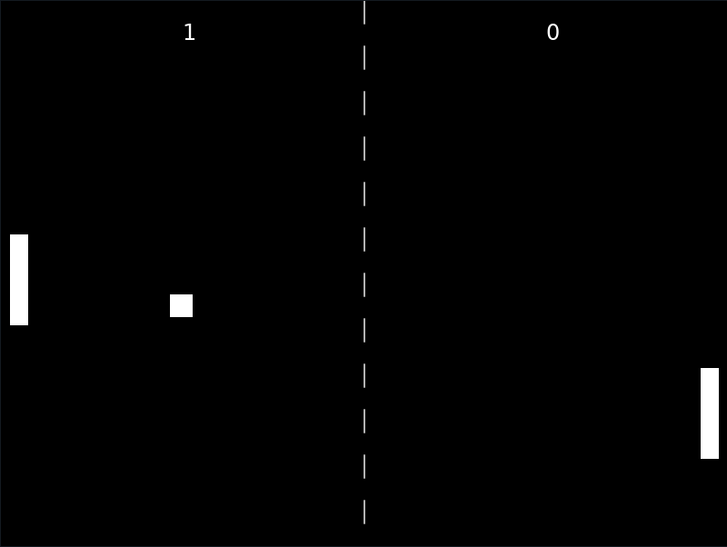

# Pong
A simple recreation of Pong using the [LÖVE](https://love2d.org/) framework. Audio is from captaincrunch80 at [opengameart.org](https://opengameart.org/content/3-ping-pong-sounds-8-bit-style).

<p align="center">
    
<p>

# Installation and Usage
The game is available as an executable for Windows and a zip file for macOS. For linux, install the LÖVE packages from your distribution and run
```bash
love Pong.love
```
To control Player 1 (on the left) use the "w" and "s" keys. To control Player 2 (on the right) use the "up" and "down" arrow keys. To mute/unmute the audio press the "m" key.